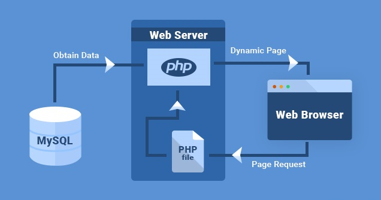
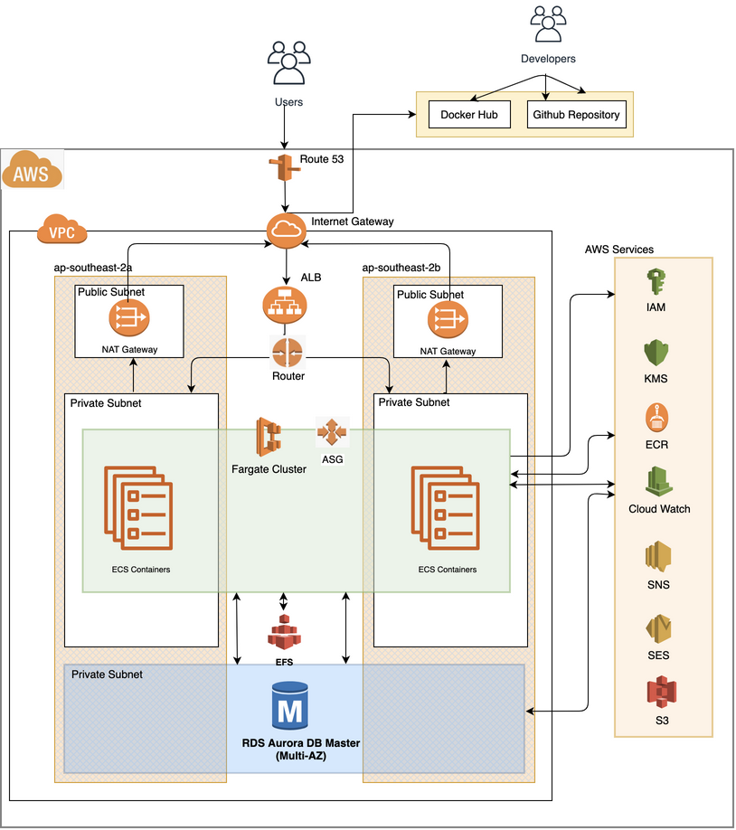

# __PROJECT - DEVOPSACADEMY - PROJECT - GROUP3__

## __MIGRATION OF ON-PREMISES WEB APP TO CLOUD__

### __TEAM MEMBERS:__

Team "Devopsacademy Project Group3" has below tech nerds contribution.

          * DANIEL ANDRADE
          * FERNANDO ROLNIK
          * JAY AMARANAYAKE
          * VANITHA KALIYAPERUMAL

Table of Contents
=================

   * [<strong>CURRENT BUSINESS STATUS:</strong>](#current-business-status)
      * [<strong>BUSINESS PROBLEM STATEMEMT:</strong>](#business-problem-statememt)
      * [<strong>BUSINESS REQUIREMENTS:</strong>](#business-requirements)
         * [<strong>PROJECT TIMELINE</strong>](#project-timeline)
      * [<strong>DELIVERABLES:</strong>](#deliverables)
      * [<strong>ASSUMPTIONS</strong>](#assumptions)
   * [<strong>TECHNOLOGY SOLUTION WALKTHROUGH</strong>](#technology-solution-walkthrough)
      * [<strong>TECHNOLOGY PRODUCTS &amp; SERVICES</strong>](#technology-products--services)
      * [<strong>PRE-REQUISITES</strong>](#pre-requisites)
      * [<strong>INSTALLATION STEPS</strong>](#installation-steps)
         * [<strong>INFRASTRUCTURE INSTALLATION</strong>](#infrastructure-installation)
            * [<strong>1. NETWORK CONFIGURATION</strong>](#1-network-configuration)
               * [<strong>1.1 VPC CREATION</strong>](#11-vpc-creation)
               * [<strong>1.2 SUBNET CREATION</strong>](#12-subnet-creation)
               * [<strong>1.3 SECURITY GROUP CREATION</strong>](#13-security-group-creation)
               * [<strong>1.4 INTERNET GATEWAY CREATION</strong>](#14-internet-gateway-creation)
               * [<strong>1.5 NAT GATEWAY CREATION</strong>](#15-nat-gateway-creation)
               * [<strong>1.6 ROUTE TABLE AND ASSOCIATIONS CREATION</strong>](#16-route-table-and-associations-creation)
               * [<strong>1.7 NETWORK ACCESS CONTROL LIST CREATION</strong>](#17-network-access-control-list-creation)
            * [<strong>2. APPLICATION LOAD BALANCER CREATION</strong>](#2-application-load-balancer-creation)
            * [<strong>3. EFS CREATION</strong>](#3-efs-creation)
            * [<strong>4. RDS CLUSTER CREATION</strong>](#4-rds-cluster-creation)
         * [<strong>APPLICATION INSTALLATION</strong>](#application-installation)
            * [<strong>1. WORDPRESS IMAGE CREATION AND UPLOAD TO REGISTRY</strong>](#1-wordpress-image-creation-and-upload-to-registry)
            * [<strong>2. ECS CLUSTER CREATION</strong>](#2-ecs-cluster-creation)
         * [<strong>LOGGING &amp; ALARMING</strong>](#logging--alarming)
      * [<strong>TERRAFORM AUTOMATIC DEPLOYMENT</strong>](#terraform-automatic-deployment)
               * [DockerFile](#dockerfile)
               * [MakeFile](#makefile)
               * [Automatic Deployment Steps](#automatic-deployment-steps)
      * [<strong>RECOMMENDATIONS</strong>](#recommendations)
         * [<strong>IMPROVEMENTS:</strong>](#improvements)
         * [<strong>FEATURES NOT DELIVERED IN THIS PHASE</strong>](#features-not-delivered-in-this-phase)
         * [<strong>RESOURCES</strong>](#resources)
         * [<em><strong>LICENSE</strong></em>](#license)
         * [<strong>CONCLUSION</strong>](#conclusion)
         * [<strong>BUSINESS SIGN-OFF</strong>](#business-sign-off)

# __CURRENT BUSINESS STATUS:__
A company in Australia currently have a web application running on-premisis in a Linux virtual machine. The application is being used by hundreds of customers every day and it is based on Wordpress which uses LAMP stack (Linux, Apache, MySQL and PHP) to offer great products.

Currently the solution is hosted in a single server (application and database) and deployments are made through FTP transfers to the server.

 

## __BUSINESS PROBLEM STATEMEMT:__
The CEO is worried that a traffic peak may bring down the website whih is a great loss to the business as a whole.

## __BUSINESS REQUIREMENTS:__
The CEO wanted to migarte the On-premesis Web Application to AWS cloud and below are the requirements for the pilot migration project. 

*  Containeraize the application using Docker.
*  The application needs to be secure (all data encrypted at rest and in transit).
*  The application needs to be Highly Available.
* The application needs to support peaks of up to 10 times the average load (scalability).
* The infrastructure needs to be reproducible and version controlled in case the CEO decides to expand the business to other parts of the world (consider infra as code).
* There must be an easy and secure way of developing, with fast feedback (consider CI/CD practices or at least automation scripts).

### __PROJECT TIMELINE__
The pilot project is expected to be completed and reviewed by mid August 2020, and ready for demostration on **17th August 2020**

## __DELIVERABLES:__
* A solution diagram containing all the components of the solution and explaining the data flow.
    
* Automatic Deployemnt strategy.
* Strategy for Logging and Alarming the health of the system.
* Strategy for handling application component failure.
* List Improvements or Features not delivered in this phase

## __ASSUMPTIONS__

1. Data Migration is out of scope as it is a pilot migration.
2. Consider to include the Unit/Integration/service test in the CI pipeline or automation scripts.
3. Single GitHib repo will be delivered.
4. This pilot migration will be delivered using Terraform code.

# __TECHNOLOGY SOLUTION WALKTHROUGH__

## __TECHNOLOGY PRODUCTS & SERVICES__
 After detailed brainstroming discussion and also considering the timelines of delivery, it is best to go with serverless in every layer of architecture possible. 
This way the infrastructrue resources are managed by AWS and gives good High Availability and Reliability to AWS resources. 

Below are the Technology Products chosen to deliver the Migration solution.

| REQUIREMENT                  |  TECHNOLOGY                  |
|------------------------------|:-----------------------------|
|  Version Control System(VCS) |  GitHub                      |
|  Infra as Code               |  Terraform                   |
|  PipeLine Tools              |  GitHub Actions              |
|  Containerization            |  Docker / Docker - Compose   |
|  Relational Database         |  AURORA RDS MySQL Serverles  |
|  Container orchestrator      |  ECS FARGATE                 |
|  Container Registry          |  ECR                         |

## __PRE-REQUISITES__
Below are the pre-requisite that needs to be setup for the team to go ahead with the provisioning of Cloud Infrastructure and application build.

| No  |  PRE-REQUISITE                                | STATUS          |
|-----|:----------------------------------------------|:----------------|
|  1  | AWS Account Creation                          | Completed       |
|  2  | Terraform Install - Teams member's laptop     | Completed       |
|  3  | GitHub Install - Team member's laptop         | Completed       |
|  4  | AWS CLI Install - Team member's laptop        | Completed       |
|  5  | Docker Install - Team member's laptop         | Completed       |
|  6  | Solution Diagram Review and Acceptance        | Completed       |
|  7  | GitHub Repository Creation                    | Completed       |
|  8  | JQ Installation -Team member's laptop         | Completed       |
|  9  | Domain Name Registration                      | In Progress     |
| 10  |                                               |                 |
|     |                                               |                 |

## __INSTALLATION STEPS__

Installation of Wordpress Application requires the Infrastructure to be available to deploy the application. Terraform is used for the creation of Infrastructure and related Networks.  

Below are the different stages of Application Installation and readiness.
   1. Infrasture Readiness
   2. Application Installation
   3. Securing Application

### __INFRASTRUCTURE INSTALLATION__

A Well architected Infrastructure needs to have High Availability, Reliability. The AWS cloud is built in Sydney region, considering the users are specific to Australia. 
Also, the infrastructure is built across 3 availability zones (ap-southeast-2) to achieve High Availabiity in case of diaster.
  
#### __1. NETWORK CONFIGURATION__

##### __1.1 VPC CREATION__
Virtual Private Cloud

=======
|  8  |                                               |                 |
|  9  |                                               |                 |
| 10  |                                               |                 |

### __INSTALLATION STEPS__

Below are the Installation steps followed:

#### __1. NETWORK CONFIGURATION__

##### __1.1 VPC CREATION__
In progress - to be updated

##### __1.2 SUBNET CREATION__
In progress - to be updated

##### __1.3 SECURITY GROUP CREATION__
In progress - to be updated

##### __1.4 INTERNET GATEWAY CREATION__
In progress - to be updated

##### __1.5 NAT GATEWAY CREATION__
In progress - to be updated

##### __1.6 ROUTE TABLE AND ASSOCIATIONS CREATION__
In progress - to be updated

##### __1.7 NETWORK ACCESS CONTROL LIST CREATION__
In progress - to be updated

#### __2. APPLICATION LOAD BALANCER CREATION__
In progress - to be updated

#### __3. EFS CREATION__
In progress - to be updated

#### __4. RDS CLUSTER CREATION__
In progress - to be updated

### __APPLICATION INSTALLATION__

#### __1. WORDPRESS IMAGE CREATION AND UPLOAD TO REGISTRY__
In progress - to be updated

#### __2. ECS CLUSTER CREATION__
In progress - to be updated

### __LOGGING & ALARMING__
In progress - to be updated

## __TERRAFORM AUTOMATIC DEPLOYMENT__

##### DockerFile

##### MakeFile

##### Automatic Deployment Steps
Below are the steps to be followed to run automatic deployment of application cluster.

## __RECOMMENDATIONS__

### __IMPROVEMENTS:__

### __FEATURES NOT DELIVERED IN THIS PHASE__

### __RESOURCES__

[WORDPRESS BEST PRACTISE] (https://aws.amazon.com/blogs/architecture/wordpress-best-practices-on-aws/)
[AUTOMATING WORDPRESS] (https://medium.com/@beBrllnt/from-30-minutes-to-10-seconds-automating-wordpress-setup-5ff7526942c0)

### ___LICENSE___

[LICENSE](./LICENSE)

### __CONCLUSION__
to be updated

### __BUSINESS SIGN-OFF__

| DENIS SILVA       |       CAIO TREVISAN      |        KIKO COLLET     |
|-------------------|:-------------------------|:-----------------------|
|                |                       |                     |
|                   |                          |                        |

